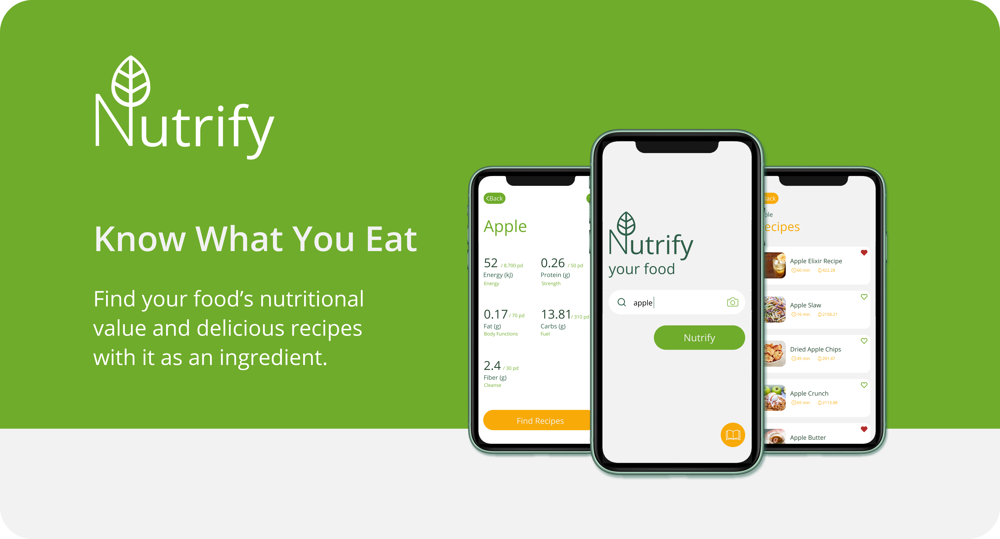
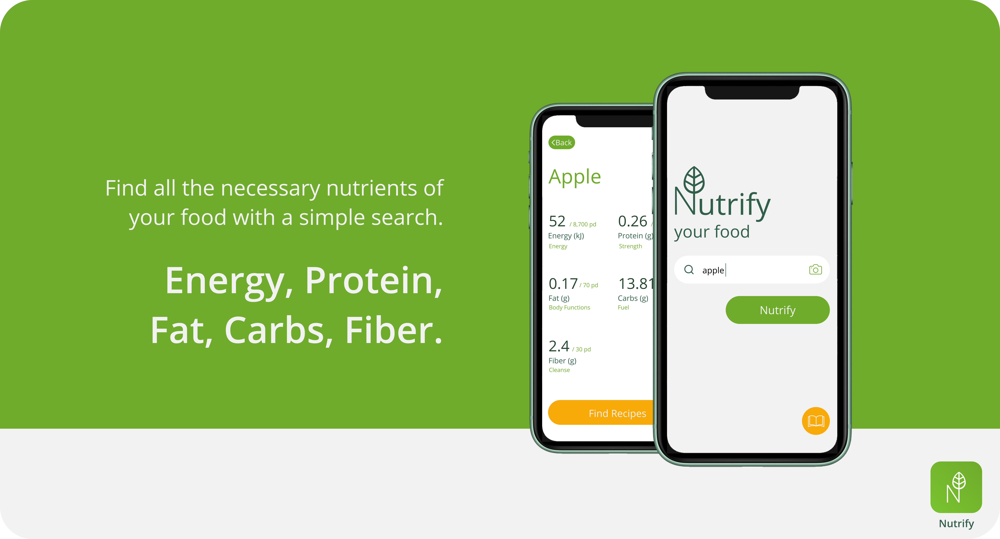
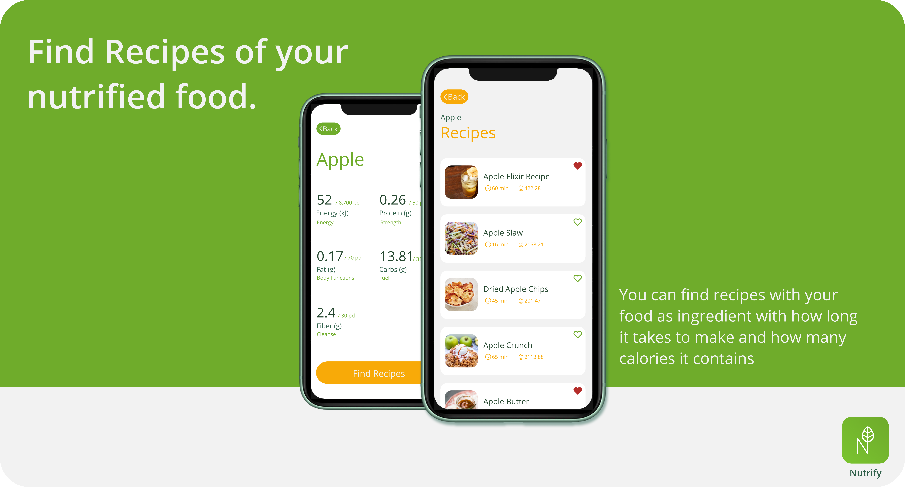
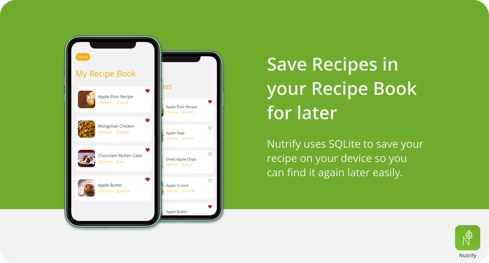
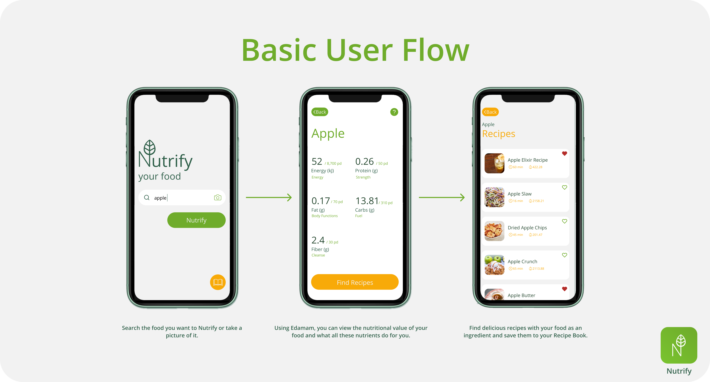

<!-- PROJECT SHIELDS -->
<!--Nutrify README.MD-->
<!--
*** I'm using markdown "reference style" links for readability.
*** Reference links are enclosed in brackets [ ] instead of parentheses ( ).
*** See the bottom of this document for the declaration of the reference variables
-->
[![Contributors][contributors-shield]][contributors-url]
[![Forks][forks-shield]][forks-url]
[![Stargazers][stars-shield]][stars-url]
[![LinkedIn][linkedin-shield]][linkedin-url]

<!-- PROJECT LOGO -->
<br />
<p align="center">
  <a href="https://github.com/ArmandPretorius/nutrify">
    
  </a>

  <h3 align="center">Nutrify</h3>

  <p align="center">
    Nutrify your Food
    <br />
    <a href="https://github.com/ArmandPretorius/nutrify"><strong>Explore the docs »</strong></a>
    <br />
    <br />
    <a href="https://youtu.be/OD3Wk6U-JDA">View Demo</a>
    ·
    <a href="https://github.com/ArmandPretorius/nutrify/issues">Report Bug</a>
    ·
    <a href="https://github.com/ArmandPretorius/nutrify/issues">Request Feature</a>
  </p>
</p>


<!-- TABLE OF CONTENTS -->
## Table of Contents

* [About the Project](#about-the-project)
  * [Built With](#built-with)
  * [Installation](#installation)
* [Features](#features)
  * [Nutrify food](#nutrifyfood)
  * [Find Recipies](#findrecipies)
  * [Recipe Book](#recipebook)
  * [AI](#ai)
* [Usage](#usage)
* [Logic](#logic)
* [Contribution](#contribution)
* [License](#license)
* [Challenges](#challenges)
* [Contact](#contact)

<!-- ABOUT THE PROJECT -->
## About The Project



For our term 3 project we were tasked to create a application that can help the user in regards
to their health. I decided to create a app that will help the user eat healthier and know what
they are putting into their bodies. 

Nutrify helps you "nutrify" your food by telling you the nutrients of your food. It gives you the
food's amount of energy, calories, fibre, fat and protein. After that you can search recipes that
contain those food. You see all the ingredients in the recipe, and also the same nutrients.

### Built With
This Android application was build using:
* [Xamarin Forms](https://dotnet.microsoft.com/apps/xamarin/xamarin-forms)
* [C#](https://dotnet.microsoft.com/apps/xamarin/xamarin-forms)
* [Edamam](https://developer.edamam.com/)
* [Clarifai](https://www.clarifai.com/)
* [SQLite](https://docs.microsoft.com/en-us/xamarin/xamarin-forms/data-cloud/data/databases)


### Installation

1. DownloadVisual Studio 2019 [https://visualstudio.microsoft.com/vs/](https://visualstudio.microsoft.com/vs/) and Include Xamarin Forms in the installation process
2. Clone the repo
```sh
git clone https:://github.com/ArmandPretorius/nutrify.git
```
3. Then open the project in Visual Studio

## Features
### Nutrify food



Find all the necessary nutrients - energy, protein, fat, carbs and fiber - of your food with a simple search. This feature is created using Edamam's nutrition API.

### Find Recipes



You can find recipes with your food as ingredient with how long it takes to make and how many calories it contains. This feature is created using Edamam's recipe API.

### Recipe Book



You can save recipes in your Recipe Book to view later. This feature used SQLite to store the recipes on your device.

### AI


Not to sure what you are eating or to lazy to type out the name, simply take a photo of your food. This feature used Clarifai's Object Recognition Engine to identify the food.

<!-- USAGE -->
## Usage

When opening the app, you are taken to the search page, where you enter the food you want to analize.
The food can be anything from an apple to a Big Mac. The app will nutrify your food, giving you the
nutrients in the food. 

From there, you can choose to search for recipes containing the food you nutrified.
You get a list of recipes with each recipe showing an image, the recipe name, the time it takes to
prepare and the amount of calories in the dish. When selecting a recipe, you can view the ingridients
of the recipe and also the amount of nutrients in the dish.



To see a run through of the application, click below:

[View Demo](https://youtu.be/OD3Wk6U-JDA)
<!-- HOW DOES IT WORK -->
## Logic

The app is programmed using Xamarin.Forms with C# handling the logic.
For a backend, Nutrify uses Edamam's Food and Recipe API containing all the nutrients of the food.
https://developer.edamam.com/

At the moment the App is only available on Android. The target operating system version is from 
Oreo 5.1 to Pie 9.


<!-- Changes Made -->
## Challenges

* I'd like to finish it for iOS as well.

* I'd also like to add the ability to share a recipe with your friends on WhatsApp, email etc.

* I also didn't have time to implement a filter on the recipe page.

<!-- CONTRIBUTING -->
## Contributing

Contributions are what make the open source community such an amazing place to be learn, inspire, and create. Any contributions you make are **greatly appreciated**.

1. Fork the Project
2. Create your Feature Branch (`git checkout -b feature/YourAmazingFeature`)
3. Commit your Changes (`git commit -m 'Add some AmazingFeature'`)
4. Push to the Branch (`git push origin feature/YourAmazingFeature`)
5. Open a Pull Request


<!-- LICENSE -->
## License

Distributed under the MIT License. See `LICENSE` for more information.


<!-- CONTACT -->
## Contact

Armand Pretorius - [@amplified_designs](https://www.instagram.com/amplified_designs/) - 170045@virtualwindow.co.za


Project Link: [https://github.com/ArmandPretorius/nutrify](https://github.com/ArmandPretorius/cclone)


<!-- MARKDOWN LINKS & IMAGES -->
[product-screenshot]: cclone_screenshot.png
<!-- MARKDOWN LINKS & IMAGES -->
<!-- https://www.markdownguide.org/basic-syntax/#reference-style-links -->
[contributors-shield]: https://img.shields.io/github/contributors/ArmandPretorius/nutrify.svg?style=flat-square
[contributors-url]: https://github.com/ArmandPretorius/nutrify/graphs/contributors
[forks-shield]: https://img.shields.io/github/forks/ArmandPretorius/nutrify.svg?style=flat-square
[forks-url]: https://github.com/ArmandPretorius/nutrify/network/members
[stars-shield]: https://img.shields.io/github/stars/ArmandPretorius/nutrify.svg?style=flat-square
[stars-url]: https://github.com/ArmandPretorius/nutrify/stargazers
[issues-shield]: https://img.shields.io/github/issues/ArmandPretorius/nutrify.svg?style=flat-square
[issues-url]: https://github.com/ArmandPretorius/nutrify/issues
[license-shield]: https://img.shields.io/github/license/ArmandPretorius/nutrify.svg?style=flat-square
[license-url]: https://github.com/ArmandPretorius/nutrify/master/LICENSE.txt
[linkedin-shield]: https://img.shields.io/badge/-LinkedIn-black.svg?style=flat-square&logo=linkedin&colorB=555
[linkedin-url]: https://www.linkedin.com/in/armand-pretorius-293b3a18a
